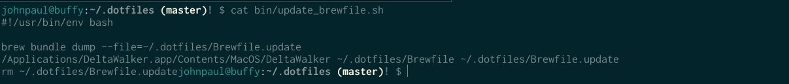
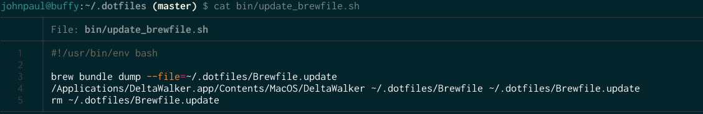
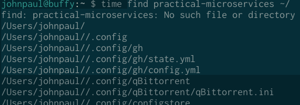
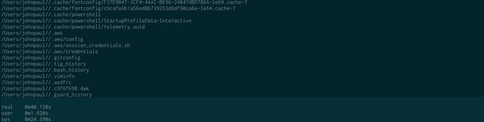
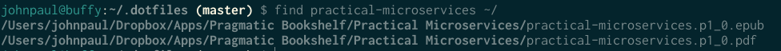
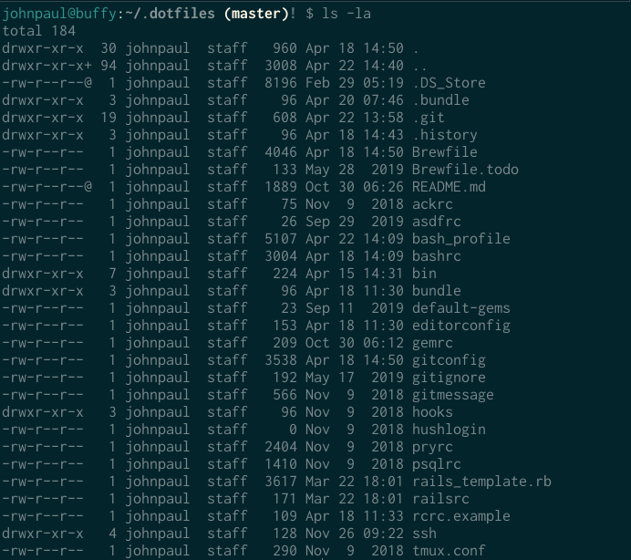
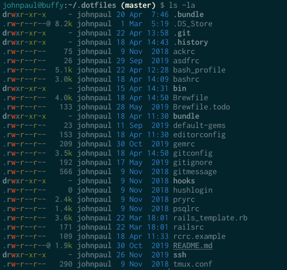
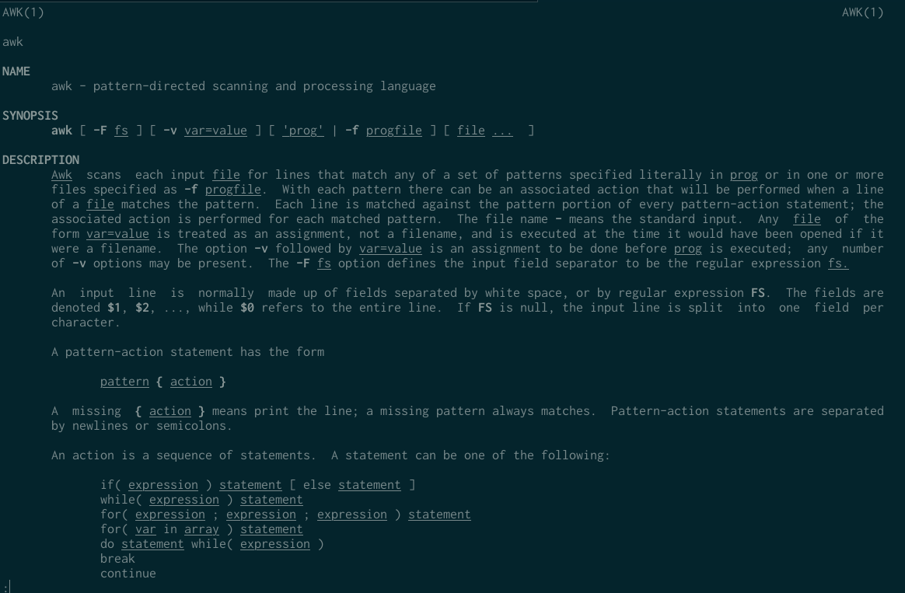
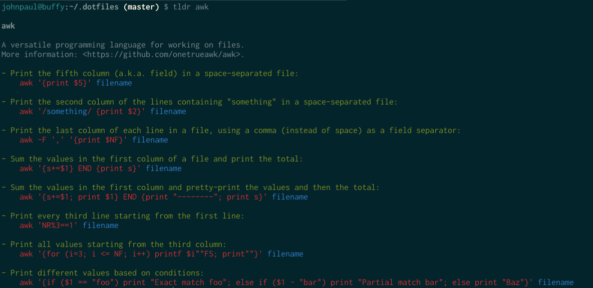

# Four CLI Replacements and a Profiler

---
# File contents with `cat`
<!-- Not just a few eating my peaches -->


---
# Replacing `cat` with `bat`
`brew install bat`

```
# .bash_profile

alias cat="bat"
```


---
# Search for a file with `find`

(many lines of output quickly scroll by)



---
# Replacing `find` with `fd`
`brew install fd`

```
# .bash_profile

alias find="fd"
```


---
# Listing a directory with `ls`


---
# Replacing `ls` with `exa`
`brew install exa`

```
# .bash_profile

alias ls="exa"
```
---


---
# Learning about `awk` with `man`



---
# Almost replacing man
`brew install tldr`


---
# Profiler

```
# .bash_profile

alias profileme="history
  | awk '{print \$2}'
  | awk 'BEGIN{FS=\"|\"}{print \$1}'
  | sort
  | uniq -c
  | sort -n
  | tail -n 20
  | sort -nr"
```
credit: http://lifehacker.com/software/how-to/turbocharge-your-terminal-274317.php

---
Profiler results:

```
$ profileme
8966 git
1276 bundle
1224 brew
1073 z
1072 b
 689 cd
 645 clear
 603 ls
 505 more
 408 rails
 401 rm
 286 rake
 278 asdf
 222 ssh
 175 stree
 151 hub
 141 s.
 135 open
 106 rspec
  99 mv
```

---
# Credits and Contact

John Paul (JP) Ashenfelter
john@ashenfelter.com
https://github.com/johnpaulashenfelter

Some CLI tools recently found in  https://blog.testdouble.com/posts/2020-04-07-favorite-things/

Presentation doing using VSCode plugin for Marp: https://marp.app/
